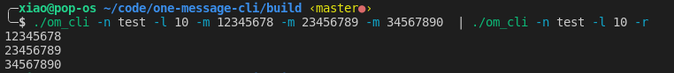
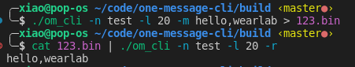
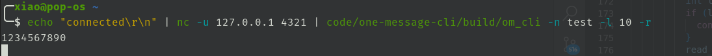
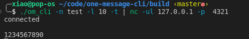

# OneMessageCLI

基于[OneMessage](https://github.com/Jiu-xiao/OneMessage)的共享话题命令行测试工具，适用于Unix平台。

```sh
Usage: /path/om_cli [options]
Options:
 -n <name>     topic name
 -l <length>   length of topic data
 -m <message>  message to send
 -r <recvice>  start to receive
 -t <transmit> start to transmit
```

## 运行截图

* 发送/接收

  

* 从文件读写

  

* UDP接收

  

* UDP发送

  
